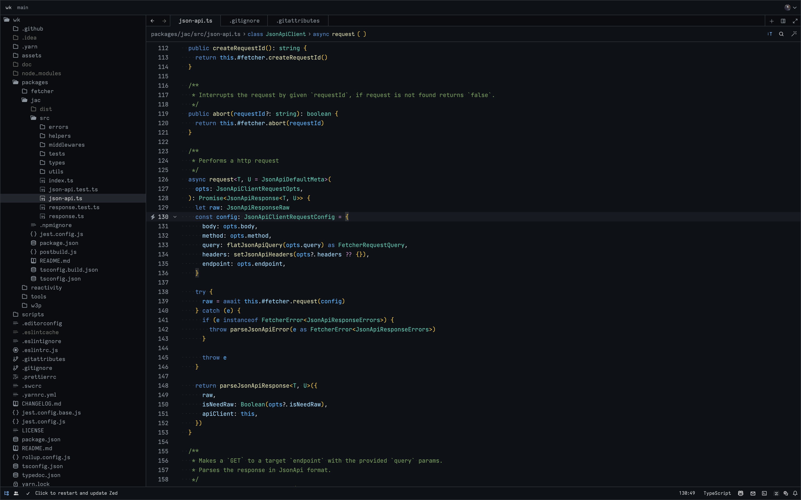

# Napalm theme for the Zed Code Editor

A minimalistic dark theme, mix of GitHub Dark UI theme and VSCode Dark+ theme syntax highlighting.

## Installing
- Copy the [napal-theme-zed.json](./napalm-theme-zed.json) file from this repo into `~/.config/zed/themes`.
- Run [Zed Preview](https://zed.dev/releases/preview)
- Select theme (Settings -> Select Theme).

